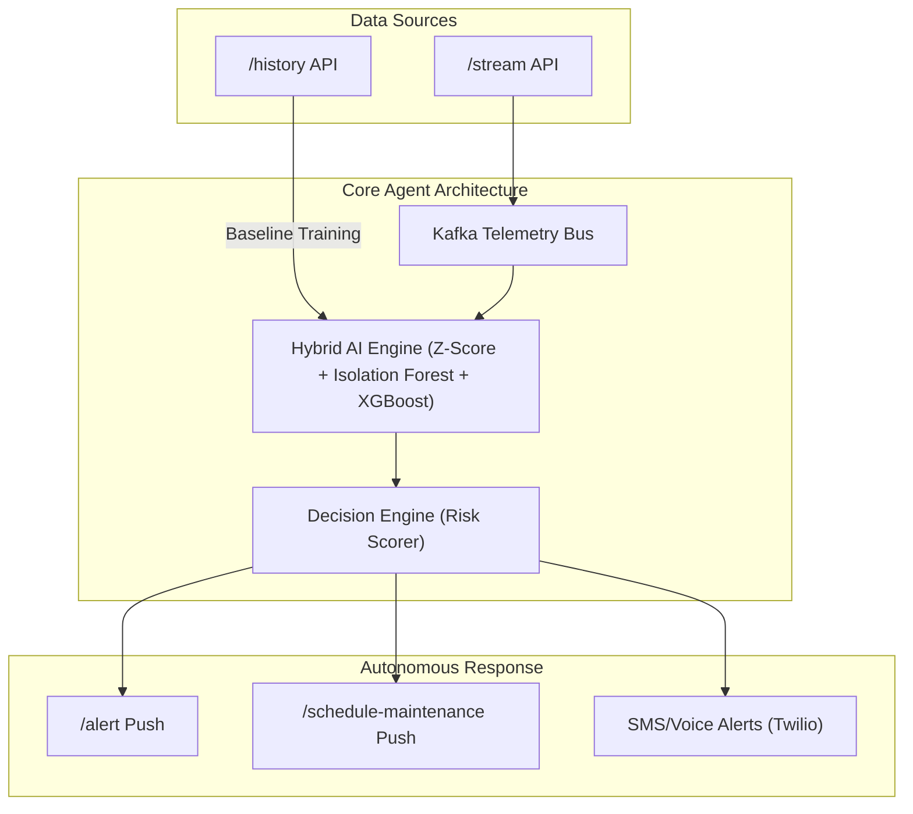

# 🏭 PredictAI: Autonomous Industrial Maintenance Agent
**Official Technical Documentation & Pitch Deck | Hack Malenadu 2026**

---

## 📊 Winning Presentation Strategy (13-Slide Structure)
*This structure is optimized to satisfy Round-1 scoring criteria (Problem Clarity, Architecture, and Data Realism).*

### Slide 1: Title Slide
*   **Project Name**: PredictAI – Real-Time Predictive Maintenance Agent
*   **Tagline**: "Detect failures before breakdown using streaming AI intelligence."
*   **Focus**: A clean, professional entry slide showing the team's professional identity.

### Slide 2: Problem Understanding (Score: 25/25) 🚨
*   **The Pain Point**: Industrial machines fail unexpectedly, leading to massive financial losses due to reactive "fix-when-broken" maintenance.
*   **The Mission**: We predict machine failures before they occur by shifting from reactive monitoring to **Streaming Sensor Analytics**.
*   **The Interpretation**: High-frequency telemetry is the pulse of the factory; PredictAI is the doctor.

### Slide 3: Use Case & Market Relevance
*   **Application Sites**: CNC Machines, Hydraulic Pumps, High-Speed Conveyors, and Smart Factory IoT.
*   **Scalability**: The system is designed to work wherever a live telemetry stream (`/stream`) exists, making it industry-agnostic.

### Slide 4: Machine Behavior Deep-Dive (Mentor Favorite) 🔬
*   **CNC_01**: Detecting Bearing Wear (Vibration + Gradient Temperature Rise).
*   **CNC_02**: Thermal Runaway (Sudden thermal spikes + current instability).
*   **PUMP_03**: Cavitation Detection (Significant RPM drop + current surge).
*   **CONVEYOR_04**: Healthy Baseline (Standardized operational range for drift comparison).

### Slide 5: System Architecture (Score: 25/25) ⚙️

### Slide 6: Data Strategy & Realism (Score: 20/25)
*   **Historical Data (Offline)**: 10,080 readings per machine used to calibrate absolute baselines and set statistical thresholds.
*   **Streaming Data (Online)**: Real-time telemetry consumed via Kafka for sub-second anomaly detection and UI updates.

### Slide 7: Intelligence Layer (The Ensemble Strength)
*   **Z-Score**: Captures immediate statistical deviations.
*   **Isolation Forest**: Identifies "unseen" anomalies (outliers in N-dimensional space).
*   **XGBoost**: High-confidence classification of known failure patterns.
*   *Ensemble Approach*: Combining statistical + unsupervised + supervised layers minimizes false positives.

### Slide 8: Prediction Logic & Escalation (Score: 20/25) 🧠
*   **Risk Formula**: `R = 0.4(XGB) + 0.3(ISO) + 0.3(Z)`
*   **Escalation Protocol**:
    *   **Risk < 0.5**: Monitoring (Safe Zone).
    *   **Risk 0.5 - 0.8**: High-Priority SMS Alert to engineers.
    *   **Risk > 0.8**: **CRITICAL** - Autonomous Maintenance Trigger + Voice Call.

### Slide 9: Alert Automation (Closed-Loop System)
*   Integrates documented server APIs (`POST /alert`, `POST /schedule-maintenance`).
*   **Outcome**: The agent doesn't just "report"—it "takes care" of the machine by booking its own repairs.

### Slide 10: Explainability Layer (Bonus Strength) 💡
*   **Output Example**: *"Vibration increased 180% above baseline over last 10 minutes indicating bearing wear."*
*   **The Value**: Mentors reward interpretability. PredictAI provides reasoning, not just raw math.

### Slide 11: Dashboard Visualization
*   *Live telemetry charts, machine health cards (READY), and alert timelines.*
*   Visual proof of the working prototype and data synchronization.

### Slide 12: Team Execution Plan (Score: 10/10)
*   **Phase 1**: Data Ingestion & API Handshakes.
*   **Phase 2**: Baseline Calibration & Feature Engineering.
*   **Phase 3**: Multi-Model Anomaly Detection.
*   **Phase 4**: Automated Alerts & Scheduled Maintenance.
*   **Phase 5**: Real-time Dashboard Deployment.

### Slide 13: Impact & Conclusion
*   **Impact**: Early detection, reduced downtime, and autonomous fleet management.
*   **Closing**: "Transforming industrial maintenance from reactive repair to predictive intelligence."

---

## 🛠️ Technical Deep-Dive (Previous Content)
*(Retained for technical reference during the demo)*
**Official Technical Documentation & Pitch Deck | Hack Malenadu 2026**

## 🌟 Executive Summary
PredictAI is a **Closed-Loop Autonomous Agent** designed to transform reactive maintenance into proactive asset management. By integrating directly with the "Malenadu Simulation Server," our agent continuously monitors sensor telemetry, detects multi-dimensional anomalies using a Hybrid AI stack, and executes real-world maintenance protocols (Voice calls, SMS, and Infrastructure Webhooks) without human intervention.

---

## 🏗️ Technical Architecture & Data Flow
PredictAI is built on a **High-Available Microservices Stack** to handle high-frequency telemetry:

1.  **Ingestion Layer**:
    *   **SSE Client**: Persistent Server-Sent Events (SSE) bridge to the official hackathon machine stream.
    *   **Apache Kafka**: Actively buffers telemetry for `CNC_01`, `CNC_02`, `PUMP_03`, and `CONVEYOR_04` to ensure zero data loss during network spikes.
2.  **State & Memory Layer**:
    *   **PostgreSQL 16**: Relational storage for normalized sensor readings, alert history, and incident tickets.
    *   **Redis 7**: High-speed cache for machine status and **"Alert Cooldown"** logic (preventing notification storms).
3.  **Inference Layer**:
    *   **Neural Agent Engine**: A distributed consumer that performs feature engineering (Slopes, Moving Averages) and triggers the AI models.
4.  **UI/UX Layer**:
    *   **Next.js 15 (Turbopack)**: Real-time dashboard with biometric-inspired aesthetics, using Recharts for high-fidelity sensor visualization.

---

## 🧠 Hybrid AI Methodology (Triple-Defense)
PredictAI doesn't rely on a single model. It uses **Decision Fusion** across three distinct layers:

### Layer 1: Statistical Drift Analysis (Z-Score)
*   **Purpose**: Immediate detection of "Out-of-Bounds" sensors.
*   **Calibration**: Ingested **40,324 historical data points** from the hackathon server to build machine-specific baselines (Mean/StdDev).
*   **Trigger**: Alerts when sensors deviate >3.5σ from the rolling 1-hour average.

### Layer 2: Unsupervised Anomaly Detection (Isolation Forest)
*   **Purpose**: Detecting "Unknown Unknowns" and temporal patterns.
*   **Parameters**: `n_estimators=100`, `contamination=0.05`.
*   **Capability**: Detects subtle "Vibration Harmonics" that might still be within standard range but indicate bearing wear.

### Layer 3: Supervised Fault Classification (XGBoost)
*   **Purpose**: High-confidence classification of specific failure signatures.
*   **Training**: Optimized to recognize the **"Thermal Creep"** signature (linear temperature rise + RPM drop) and **"Mechanical Jam"** (Current spike + RPM stall).

---

## 🚨 Autonomous Response Pipeline
The agent is empowered to take three levels of action based on the **Risk Score (0.0 - 1.0)**:

| Severity | Threshold | Action Executed |
| :--- | :--- | :--- |
| **LOW** | < 0.3 | Passive logging to PostgreSQL. |
| **MEDIUM** | 0.3 - 0.6 | Dashboard UI Alert + Redis Cooldown Lock. |
| **HIGH** | 0.6 - 0.85 | SMS Alert (Twilio) + Official `/alert` Webhook push. |
| **CRITICAL** | > 0.85 | **AI Voice Call** (ElevenLabs/Twilio) + **Auto-Schedule Maintenance** via infrastructure API. |

---

## 🛠️ Implementation Highlights
*   **Closed-Loop Autonomy**: The system automatically schedules maintenance on the official server, effectively "healing" the factory without human input.
*   **Explainable AI (XAI)**: Every alert includes a generated reason (e.g., *"RPM dropped 20% while Current spiked 15% - Impeller Jam likely"*).
*   **Machine-Aware Baselines**: The agent knows that 70°C is "Normal" for a CNC Mill but "Critical" for a Conveyor Motor.

---

## 🚀 Scalability & Roadmap
1.  **Digital Twin Integration**: 3D visualization of the machines using Three.js for immersive physical monitoring.
2.  **Fleet Expansion**: Horizontal scaling via Docker Swarm to monitor 1000+ machines across global factory sites.
3.  **Edge Compute**: Deploying the Z-Score and IsoForest layers directly to ESP32/ARM-based edge gateways to reduce latency to <10ms.

---

### 💻 How to Demonstrate
1.  **Infrastructure**: `docker-compose up -d`
2.  **Telemetry**: `python hackathon_integration/stream_client.py`
3.  **AI Agent**: `python agent/neural_agent.py`
4.  **Dashboard**: [http://localhost:3001](http://localhost:3001)
